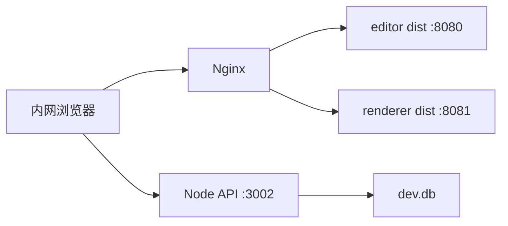
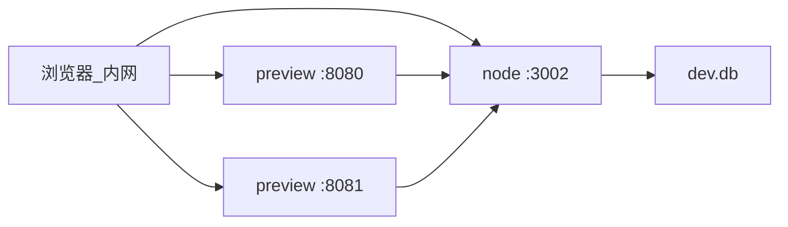

# Linux + Nginx 构建与部署指南

本文描述在 **已安装 Nginx** 的 Linux 服务器上部署 mvp_vue 全套服务（Editor、Renderer、Fastify API + SQLite）。

> **内网标准方案（推荐）**：Nginx 只托管 **Editor / Renderer 静态 `dist/`**（8080、8081）；**API 不经过 Nginx 反代**，浏览器直连 `http://<服务器IP>:3002`。详见 [§1.1](#11-内网-ip-部署推荐)。

---

## 0. 部署速查（内网标准方案）

下列占位符请替换为实际值：

| 占位符 | 示例 |
|--------|------|
| `<SERVER_IP>` | `192.168.8.144` |
| `<DEPLOY_PATH>` | `/opt/mvp_vue` 或 `/home/user/prj/mvp_vue` |
| `<LINUX_USER>` | 运行 Node 的 Linux 用户 |

### 0.1 开发机构建

1. 编辑 `packages/editor/.env.production` 与 `packages/renderer/.env.production`：

```env
VITE_API_BASE=http://<SERVER_IP>:3002
```

Editor 另加（与后端 `PAGE_POLICY=strict` 成对）：

```env
VITE_PAGE_POLICY=strict
```

2. **保存文件后** 构建（勿使用会覆盖 env 的 `pnpm build:trial`，除非设置了 `MVP_SERVER_IP`）：

```bash
pnpm install
pnpm build
pnpm prisma:generate    # 停掉本机 dev:server 后再执行（Windows 可能 EPERM）
pnpm build:server       # 含 @mvp-vue/schema 编译
```

3. 确认打进包里的 API 地址（PowerShell 示例）：

```powershell
[regex]::Matches((Get-Content packages\editor\dist\assets\index-*.js -Raw), 'http://[^"''\s]+:3002') | % Value
```

### 0.2 上传到服务器

整仓同步（排除 `node_modules`；**勿让 `--delete` 删掉服务器上的 `dev.db`**，见 [scripts/rsync-to-server.sh](../scripts/rsync-to-server.sh)）或至少上传：

- `packages/editor/dist/`、`packages/renderer/dist/`
- `packages/server/dist/`、`packages/server/prisma/`（含 `dev.db`）
- `package.json`、`pnpm-lock.yaml`、`pnpm-workspace.yaml`、`packages/schema/`

### 0.3 服务器初始化

```bash
cd <DEPLOY_PATH>
pnpm install --frozen-lockfile
pnpm -F @mvp-vue/schema build          # 若本机已 build 且同步了 schema/dist 可跳过
pnpm -F @mvp-vue/server exec prisma generate
```

### 0.4 配置并启动 API（systemd）

```bash
sudo cp doc/systemd/mvp-server.service.example /etc/systemd/system/mvp-server.service
# 编辑 User、WorkingDirectory 为 <LINUX_USER> 与 <DEPLOY_PATH>/packages/server
sudo systemctl daemon-reload
sudo systemctl enable --now mvp-server
curl -s http://127.0.0.1:3002/api/publish/pages | head -c 200
curl -s http://<SERVER_IP>:3002/api/publish/pages | head -c 200
```

### 0.5 配置 Nginx（仅静态）

```bash
sudo cp doc/nginx/mvp-intranet.conf.example /etc/nginx/sites-available/mvp-vue
# 编辑 root 为 <DEPLOY_PATH>/packages/editor|renderer/dist
sudo ln -sf /etc/nginx/sites-available/mvp-vue /etc/nginx/sites-enabled/
sudo nginx -t && sudo systemctl reload nginx
```

停掉试运行的 `vite preview`（若有）。

### 0.6 防火墙

```bash
sudo firewall-cmd --permanent --add-port=8080/tcp --add-port=8081/tcp --add-port=3002/tcp
sudo firewall-cmd --reload
```

### 0.7 验收

| 检查 | URL |
|------|-----|
| API | `http://<SERVER_IP>:3002/api/publish/pages` |
| 编辑器 | `http://<SERVER_IP>:8080` |
| 渲染器 | `http://<SERVER_IP>:8081/?id=<发布页ID>` |

浏览器 F12 → Network：接口应指向 `http://<SERVER_IP>:3002`，**不是** `localhost` 或 `127.0.0.1`（除非仅本机浏览器访问）。

试运行说明见 [§4.4](#44-无-nginx-试运行内网验收)。

---

## 1. 架构概览

```
                    ┌─────────────────────────────────────┐
  浏览器 ──HTTPS──► │ Nginx                               │
                    │  editor.example.com  → 静态 (Editor) │
                    │  screen.example.com  → 静态 (Renderer)│
                    │  api.example.com/api → 反代 :3002     │
                    └──────────────┬──────────────────────┘
                                   │ 127.0.0.1:3002
                    ┌──────────────▼──────────────────────┐
                    │ systemd: @mvp-vue/server             │
                    │ packages/server/prisma/dev.db       │
                    └─────────────────────────────────────┘
```


| 组件       | 产物                        | 运行时                 |
| -------- | ------------------------- | ------------------- |
| Editor   | `packages/editor/dist/`   | Nginx 静态文件          |
| Renderer | `packages/renderer/dist/` | Nginx 静态文件          |
| API      | `packages/server/dist/`   | Node.js（systemd 守护） |


**公网 / 域名**：Editor / Renderer 用独立子域名；API 可用子域名或 `/api/` 反代，见 [§7](#7-nginx-配置公网--域名)。

> **内网无域名**：按 [§1.1 内网 IP 部署（推荐）](#11-内网-ip-部署推荐) 执行。

### 1.1 内网 IP 部署（推荐）

内网场景：**Nginx 托管静态站**，**API 由 Node 直接对外提供**（与试运行一致，仅把 `vite preview` 换成 Nginx）。



假设服务器内网 IP 为 `<SERVER_IP>`（示例 `192.168.8.144`）：

| 服务 | 地址 | 运行时 |
|------|------|--------|
| Editor | `http://<SERVER_IP>:8080` | Nginx → `packages/editor/dist` |
| Renderer | `http://<SERVER_IP>:8081/?id=<发布页ID>` | Nginx → `packages/renderer/dist` |
| API | `http://<SERVER_IP>:3002` | systemd → `node dist/index.js`（监听 `0.0.0.0:3002`） |

**构建环境变量**（`packages/editor/.env.production` 与 `packages/renderer/.env.production`）：

```env
VITE_API_BASE=http://<SERVER_IP>:3002
```

Editor 额外（与后端 `PAGE_POLICY=strict` 成对）：

```env
VITE_PAGE_POLICY=strict
```

**勿**将 `VITE_API_BASE` 设为 `http://127.0.0.1:3002`，除非 **只有服务器本机上的浏览器** 会访问编辑器；内网其它电脑访问时，`127.0.0.1` 指向用户自己的电脑，会导致「加载失败」。

**Nginx**：仅两个 `server`（无 API 反代）。完整示例见 [doc/nginx/mvp-intranet.conf.example](nginx/mvp-intranet.conf.example)。

```bash
sudo cp doc/nginx/mvp-intranet.conf.example /etc/nginx/sites-available/mvp-vue
# 修改 root 路径后：
sudo ln -sf /etc/nginx/sites-available/mvp-vue /etc/nginx/sites-enabled/
sudo nginx -t && sudo systemctl reload nginx
```

防火墙（firewalld 示例）：

```bash
sudo firewall-cmd --permanent --add-port=8080/tcp --add-port=8081/tcp --add-port=3002/tcp
sudo firewall-cmd --reload
```

**检查**：

```bash
curl -s http://<SERVER_IP>:3002/api/publish/pages | head -c 200
curl -I http://<SERVER_IP>:8080
curl -I "http://<SERVER_IP>:8081/?id=103"
```

#### 1.1.1 可选：API 经 Nginx 8082 反代（不对外暴露 3002）

若希望内网 **不开放 3002**，仅通过 Nginx 访问 API，可增加第三个 `server` 监听 `8082` 反代到 `127.0.0.1:3002`，并将构建改为：

```env
VITE_API_BASE=http://<SERVER_IP>:8082
```

防火墙只放行 `8080/8081/8082`，不放行 `3002`。此方案与「直连 3002」二选一，**改端口后必须重新 `pnpm build` 并上传 dist**。

#### 1.1.2 可选：同 IP 单端口 + 路径前缀（方案 B）

只占用 **80 端口**，URL 形如：


| 服务       | 地址                                        |
| -------- | ----------------------------------------- |
| Editor   | `http://192.168.1.100/editor/`            |
| Renderer | `http://192.168.1.100/screen/?id=<发布页ID>` |
| API      | `http://192.168.1.100/api/...`            |


**1. 修改 Vite 公共路径**（构建前，各包 `vite.config.ts`）：

```ts
export default defineConfig({
  base: '/editor/',   // renderer 包改为 base: '/screen/'
  // ...
})
```

**2. 构建环境变量**：

```env
VITE_API_BASE=http://192.168.1.100
```

**3. Nginx**：

```nginx
server {
    listen 80;
    server_name 192.168.1.100;   # 或 default_server

    client_max_body_size 20m;

    location /api/ {
        proxy_pass http://127.0.0.1:3002/api/;
        proxy_http_version 1.1;
        proxy_set_header Host $host;
        proxy_set_header X-Real-IP $remote_addr;
        proxy_set_header X-Forwarded-For $proxy_add_x_forwarded_for;
    }

    location /editor/ {
        alias /opt/mvp_vue/packages/editor/dist/;
        try_files $uri $uri/ /editor/index.html;
    }

    location /screen/ {
        alias /opt/mvp_vue/packages/renderer/dist/;
        try_files $uri $uri/ /screen/index.html;
    }
}
```

> 路径方案需改源码中的 `base` 并重新构建；内网优先用 [§1.1](#11-内网-ip-部署推荐)（三端口 + API 直连 3002）。

---

#### IP 变更时

`VITE_API_BASE` 在构建时写入静态包。**服务器 IP 变了必须重新构建前端** 并同步 `dist/`，仅改 Nginx 不够。

#### 内网检查命令（标准方案）

```bash
curl -s http://<SERVER_IP>:3002/api/publish/pages | head -c 200
curl -I http://<SERVER_IP>:8080
curl -I "http://<SERVER_IP>:8081/?id=103"
```

---

## 2. 服务器前置条件


| 项       | 要求                                                                    |
| ------- | --------------------------------------------------------------------- |
| OS      | Linux（Ubuntu 22.04+ / Debian 12+ 等）                                   |
| Node.js | **≥ 20.12**（`node -v`）                                                |
| pnpm    | **≥ 9**（`corepack enable && corepack prepare pnpm@latest --activate`） |
| Nginx   | 已安装并运行                                                                |
| 防火墙     | 内网标准方案：开放 **8080、8081、3002**；若采用 §1.1.1 反代方案则开放 8082 而不开放 3002      |
| 域名      | 公网部署时使用；**内网可仅用 IP**（§1.1）                                            |


---

## 3. 目录与部署用户（示例）

```bash
sudo useradd -r -m -d /opt/mvp_vue -s /usr/sbin/nologin mvp
sudo mkdir -p /opt/mvp_vue
sudo chown mvp:mvp /opt/mvp_vue
```

后续应用代码、数据库、`node` 进程均以用户 `mvp` 运行；Nginx 只读静态目录。

---

## 4. 构建（本地或 CI）

### 4.1 生产环境变量（构建前必设）

在项目根目录创建 **构建用** 环境文件（勿提交密钥）：

`**packages/editor/.env.production`**

```env
# API 根地址（无末尾斜杠）；须与 Nginx 反代对外地址一致
VITE_API_BASE=https://api.example.com

# 生产建议启用：调试表只读，编辑/保存走发布表
VITE_PAGE_POLICY=strict
```

`**packages/renderer/.env.production**`

```env
VITE_API_BASE=https://api.example.com
```

> `VITE_*` 在 `**pnpm build` 时打入静态包**，部署后改 Nginx 不会自动生效，需重新构建。

若 API 与前端同域（例如 `https://mvp.example.com/api/` 反代），可设：

```env
VITE_API_BASE=https://mvp.example.com
```

### 4.2 构建命令

在开发机或 CI 中：

```bash
git clone https://github.com/Derek-Wang2016/mvp_vue.git
cd mvp_vue
pnpm install --frozen-lockfile

# 前端静态包
pnpm build

# 后端 TypeScript 编译（须先编译 schema，否则 node start 无法加载 .ts）
pnpm -F @mvp-vue/server exec prisma generate
pnpm build:server
```

产物：


| 路径                        | 说明               |
| ------------------------- | ---------------- |
| `packages/editor/dist/`   | 编辑器静态站           |
| `packages/renderer/dist/` | 渲染器静态站           |
| `packages/server/dist/`   | API `index.js` 等 |


### 4.3 上传到服务器

**方式 A — 整仓部署（推荐，便于升级与 prisma）**

```bash
rsync -avz --exclude node_modules --exclude .git \
  ./ mvp@your-server:/opt/mvp_vue/
```

**方式 B — 仅产物 + 运行所需包**

至少上传：

```
/opt/mvp_vue/
├── package.json
├── pnpm-lock.yaml
├── pnpm-workspace.yaml
├── packages/schema/
├── packages/server/          # 含 dist/、prisma/dev.db、prisma/schema.prisma
└── packages/editor/dist/     # 或单独放到 /var/www/...
    packages/renderer/dist/
```

### 4.4 无 Nginx 试运行（内网验收）

不配 Nginx 时，在 Linux 服务器上用 **Node 跑 API** + **Vite preview（或 serve）托管静态 `dist/`**，内网浏览器即可验收。正式上线仍按下文 §6 systemd + §7 Nginx。



| 服务 | 试运行端口 | 命令 |
|------|------------|------|
| API | 3002 | `PAGE_POLICY=strict pnpm -F @mvp-vue/server start` |
| Editor | 8080 | `pnpm preview:editor` 或包内 `pnpm preview` |
| Renderer | 8081 | `pnpm preview:renderer` |

#### 4.4.1 开发机：按服务器 IP 构建

**勿**在 `.env.production` 中保留 `VITE_API_BASE=http://localhost:3002`，否则内网其它电脑访问静态站时 API 会指向各自本机的 localhost。

```bash
# 将 192.168.1.100 换成你的 Linux 服务器内网 IP
export MVP_SERVER_IP=192.168.1.100
pnpm build:trial
# 等价于：prepare-trial-env → pnpm build → prisma:generate → build:server
```

也可手动复制示例后编辑再构建：

- [packages/editor/.env.production.example](../packages/editor/.env.production.example)
- [packages/renderer/.env.production.example](../packages/renderer/.env.production.example)

未设置 `VITE_API_BASE` 时，前端回退为 `http://<浏览器当前主机名>:3002`；用 preview 在 `8080/8081` 打开且 API 暴露在同一 IP 的 `3002` 时，可不写死 env 再构建（仍建议显式设置以免歧义）。

#### 4.4.2 上传到服务器

```bash
export MVP_DEPLOY_HOST=mvp@192.168.1.100
export MVP_DEPLOY_PATH=/opt/mvp_vue
chmod +x scripts/rsync-to-server.sh
./scripts/rsync-to-server.sh
```

#### 4.4.3 服务器：安装与启动

```bash
ssh mvp@192.168.1.100
cd /opt/mvp_vue
chmod +x scripts/server-trial-*.sh
./scripts/server-trial-setup.sh
```

启动（有 **tmux** 时一键三进程；否则脚本会打印三条手动命令）：

```bash
./scripts/server-trial-start.sh
```

或分终端：

```bash
PAGE_POLICY=strict pnpm -F @mvp-vue/server start
pnpm preview:editor    # 在仓库根目录
pnpm preview:renderer
```

验证：

```bash
export MVP_SERVER_IP=192.168.1.100   # 或 127.0.0.1 仅在服务器本机测
./scripts/server-trial-verify.sh
```

防火墙（firewalld，需 root）：

```bash
sudo ./scripts/server-trial-firewall.sh
```

浏览器：`http://<服务器IP>:8080`（编辑）、`http://<服务器IP>:8081/?id=<发布页ID>`（渲染）。发布页 ID：`curl http://<IP>:3002/api/publish/pages`。

#### 4.4.4 试运行后

- 停掉 preview / 前台 API，改用 [§0](#0-部署速查内网标准方案)（systemd + Nginx 静态）
- **标准内网方案**：`VITE_API_BASE` 保持 `http://<SERVER_IP>:3002`，无需改为 8082
- 仅当采用 [§1.1.1](#111-可选api-经-nginx-8082-反代不对外暴露-3002) 时，才改为 `:8082` 并重新 `pnpm build`

---

## 5. 服务器安装与初始化

SSH 登录后以 `mvp` 用户执行：

```bash
cd /opt/mvp_vue
pnpm install --frozen-lockfile --prod=false
pnpm -F @mvp-vue/server exec prisma generate
```

### 5.1 数据库

- 文件位置：`packages/server/prisma/dev.db`
- 从开发机拷贝时 **停掉 API 进程** 再复制，避免损坏
- 权限示例：

```bash
chmod 640 /opt/mvp_vue/packages/server/prisma/dev.db
chown mvp:mvp /opt/mvp_vue/packages/server/prisma/dev.db
```

首次空库（无 dev.db）时：

```bash
pnpm -F @mvp-vue/server exec prisma db push
# 可选 Mock 数据（不删页面表）
pnpm -F @mvp-vue/server db:seed
```

### 5.2 验证 API 本地启动

```bash
cd /opt/mvp_vue
PAGE_POLICY=strict pnpm -F @mvp-vue/server start
# 另开终端
curl -s http://127.0.0.1:3002/api/publish/pages | head -c 200
```

确认无误后 Ctrl+C，改用 systemd（下一节）。

---

## 6. systemd 守护 API

创建 `/etc/systemd/system/mvp-server.service`：

```ini
[Unit]
Description=mvp_vue Fastify API
After=network.target

[Service]
Type=simple
User=mvp
Group=mvp
WorkingDirectory=/opt/mvp_vue/packages/server
Environment=NODE_ENV=production
Environment=PAGE_POLICY=strict
ExecStart=/usr/bin/node dist/index.js
Restart=on-failure
RestartSec=5

# 可选：限制内存
# MemoryMax=512M

[Install]
WantedBy=multi-user.target
```

```bash
sudo systemctl daemon-reload
sudo systemctl enable mvp-server
sudo systemctl start mvp-server
sudo systemctl status mvp-server
```

日志：`journalctl -u mvp-server -f`

---

## 7. Nginx 配置

以下示例域名请替换为你的实际域名。静态文件路径按实际上传位置调整。

### 7.1 API 反代 — `api.example.com`

```nginx
# /etc/nginx/sites-available/mvp-api
server {
    listen 80;
    server_name api.example.com;

    # 若已配置 HTTPS，改为 listen 443 ssl; 并加载证书

    client_max_body_size 20m;

    location / {
        proxy_pass http://127.0.0.1:3002;
        proxy_http_version 1.1;
        proxy_set_header Host $host;
        proxy_set_header X-Real-IP $remote_addr;
        proxy_set_header X-Forwarded-For $proxy_add_x_forwarded_for;
        proxy_set_header X-Forwarded-Proto $scheme;
    }
}
```

Fastify 已启用 CORS；生产环境 API 仅经 Nginx 对内网 `:3002` 转发即可。

### 7.2 Editor — `editor.example.com`

```nginx
# /etc/nginx/sites-available/mvp-editor
server {
    listen 80;
    server_name editor.example.com;

    root /opt/mvp_vue/packages/editor/dist;
    index index.html;

    location / {
        try_files $uri $uri/ /index.html;
    }

    location ~* \.(js|css|png|jpg|jpeg|gif|ico|svg|woff2?)$ {
        expires 7d;
        add_header Cache-Control "public, immutable";
    }
}
```

### 7.3 Renderer — `screen.example.com`

渲染器通过 `?id=<发布页ID>` 加载页面，同样是 SPA：

```nginx
# /etc/nginx/sites-available/mvp-screen
server {
    listen 80;
    server_name screen.example.com;

    root /opt/mvp_vue/packages/renderer/dist;
    index index.html;

    location / {
        try_files $uri $uri/ /index.html;
    }

    location ~* \.(js|css|png|jpg|jpeg|gif|ico|svg|woff2?)$ {
        expires 7d;
        add_header Cache-Control "public, immutable";
    }
}
```

### 7.4 启用站点与 HTTPS

```bash
sudo ln -s /etc/nginx/sites-available/mvp-api /etc/nginx/sites-enabled/
sudo ln -s /etc/nginx/sites-available/mvp-editor /etc/nginx/sites-enabled/
sudo ln -s /etc/nginx/sites-available/mvp-screen /etc/nginx/sites-enabled/
sudo nginx -t
sudo systemctl reload nginx

# 推荐：Let's Encrypt（certbot）
# sudo certbot --nginx -d api.example.com -d editor.example.com -d screen.example.com
```

启用 HTTPS 后，确认构建时 `VITE_API_BASE` 使用 `https://` 地址并 **重新构建** 前端。

### 7.5 单域名 + `/api/` 反代（可选）

若希望 `https://mvp.example.com/api/` 转发后端，可增加：

```nginx
location /api/ {
    proxy_pass http://127.0.0.1:3002/api/;
    proxy_http_version 1.1;
    proxy_set_header Host $host;
    proxy_set_header X-Real-IP $remote_addr;
    proxy_set_header X-Forwarded-For $proxy_add_x_forwarded_for;
    proxy_set_header X-Forwarded-Proto $scheme;
}
```

构建时设 `VITE_API_BASE=https://mvp.example.com`（前端请求形如 `https://mvp.example.com/api/publish/pages/...`）。

### 7.6 内网 IP

无域名时按 [§1.1 内网 IP 部署（推荐）](#11-内网-ip-部署推荐)：`8080/8081` 为 Nginx 静态，API 直连 `:3002`。Nginx 示例见 [doc/nginx/mvp-intranet.conf.example](nginx/mvp-intranet.conf.example)。

---

## 8. 发布与升级流程

### 8.1 日常升级（有代码变更）

```bash
# 1. 本地/CI 构建
pnpm build
pnpm -F @mvp-vue/server build

# 2. 备份数据库
ssh mvp@server 'cp /opt/mvp_vue/packages/server/prisma/dev.db \
  /opt/mvp_vue/packages/server/prisma/dev.db.bak.$(date +%F)'

# 3. 同步文件
rsync -avz packages/editor/dist/ mvp@server:/opt/mvp_vue/packages/editor/dist/
rsync -avz packages/renderer/dist/ mvp@server:/opt/mvp_vue/packages/renderer/dist/
rsync -avz packages/server/dist/ mvp@server:/opt/mvp_vue/packages/server/dist/

# 4. 若 prisma schema 有变
ssh mvp@server 'cd /opt/mvp_vue && pnpm -F @mvp-vue/server exec prisma db push'

# 5. 重启 API
ssh mvp@server 'sudo systemctl restart mvp-server'
```

Nginx 静态目录更新后 **无需 reload**；仅 `nginx.conf` 变更时才 `nginx -t && systemctl reload nginx`。

### 8.2 仅前端变更

只 rsync `packages/editor/dist/` 与/或 `packages/renderer/dist/`，不必重启 API。

### 8.3 页面发布（业务操作）

1. 在 Editor 编辑并保存（strict 模式下写入 **发布表**）。
2. 或从调试表 promote：`POST /api/publish/pages/from-draft/:draftId`。
3. Renderer 访问：`https://screen.example.com/?id=<PagePublished.id>`
  可选全屏：`&fullscreen=1`

---

## 9. 生产检查清单


| 检查项       | 命令 / 说明                                                           |
| --------- | ----------------------------------------------------------------- |
| API 进程    | `systemctl is-active mvp-server`                                  |
| 本地 API    | `curl -s http://127.0.0.1:3002/api/publish/pages`                 |
| 内网 API    | `curl -s http://<SERVER_IP>:3002/api/publish/pages`               |
| 公网 API    | `curl -s https://api.example.com/api/publish/pages`（域名方案）      |
| Editor 打开 | 内网 `http://<SERVER_IP>:8080` 或域名方案                          |
| Renderer  | 内网 `http://<SERVER_IP>:8081/?id=` 或域名方案                       |
| 3002 暴露策略 | 内网标准方案：`3002` 对内网开放；若用 §1.1.1 反代则仅 `127.0.0.1:3002` |
| strict 策略 | `systemctl show mvp-server -p Environment` 含 `PAGE_POLICY=strict` |
| 数据库备份     | 定时任务拷贝 `dev.db`                                                   |


---

## 10. 常见问题

**Q：Editor 报网络错误或 CORS**  
A：检查 `VITE_API_BASE` 是否与浏览器实际请求的 API 域名一致；改后需重新 `pnpm build`。

**Q：Renderer 404 / 加载失败**  
A：确认 URL 用的是 **发布表 id**（`PagePublished`），不是 draft id。

**Q：`prisma generate` 失败 / 找不到 Client**  
A：在仓库根目录执行 `pnpm install` 后 `pnpm -F @mvp-vue/server exec prisma generate`；若 pnpm 拦截 postinstall，需手动 generate（与开发环境相同）。

**Q：SQLite 数据库被锁**  
A：确保只有一个 `mvp-server` 实例；不要 NFS 多机共写同一 `dev.db`。

**Q：内网用 IP 访问要注意什么？**  
A：构建时设 `VITE_API_BASE=http://<SERVER_IP>:3002`（标准方案，API 直连，Nginx 只托管静态）。**不要**写 `127.0.0.1`，除非仅本机浏览器访问。IP 变更须重新 `pnpm build` 并上传 dist。保存 `.env.production` 后再构建，并用 `Select-String`/Network 确认打进包的 URL。

**Q：构建后仍是旧 IP 或 localhost？**  
A：确认磁盘上 `.env.production` 已保存；勿在保存后执行 `pnpm build:trial`（会覆盖 env）；删除 `dist` 后重新 `pnpm build:editor`；上传 dist 后浏览器强刷。

**Q：能否不用 Nginx 反代、继续用 3002？**  
A：可以，且为当前文档推荐的内网做法；Nginx 仅负责 8080/8081 静态站。

**Q：子路径部署（如 `/editor/`）**  
A：需在对应包的 `vite.config.ts` 设置 `base: '/editor/'`，并重新构建；默认文档按子域名根路径方案编写。

---

## 11. 相关文件


| 文件                                                        | 用途       |
| --------------------------------------------------------- | -------- |
| [.env.example](../.env.example)                           | 开发环境变量说明 |
| [packages/editor/.env.production.example](../packages/editor/.env.production.example) | 编辑器生产 env 模板 |
| [packages/renderer/.env.production.example](../packages/renderer/.env.production.example) | 渲染器生产 env 模板 |
| [doc/nginx/mvp-intranet.conf.example](nginx/mvp-intranet.conf.example) | 内网 Nginx 配置模板 |
| [doc/systemd/mvp-server.service.example](systemd/mvp-server.service.example) | API systemd 模板 |
| [packages/server/README.md](../packages/server/README.md) | 后端命令与迁移  |
| [README.md](../README.md)                                 | 本地开发快速开始 |


